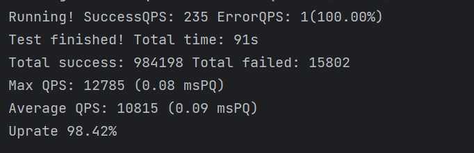

# LT4J
Load Test 4 Java - An internal tool used to perform load-test on BukkitHTTP.

````
Not intended for public use.
A brief how-to:
1. Download the source code.
2. Edit the TaskRunnable class to match your needs.
3. Edit the Main class to specify the server address, port, flag, and the number of tasks.
4. Edit the Executor class to specify the number of threads.
````

## Screenshots


## Disclaimer
Do not use this tool to perform load-test on any public server without proper permission from the server owner.  
I am not responsible for any damage caused by this tool, especially if you've modified it.  
Any translation of this disclaimer is not official, and may not be accurate, thus you may not use this tool if English is not official language of your country.
